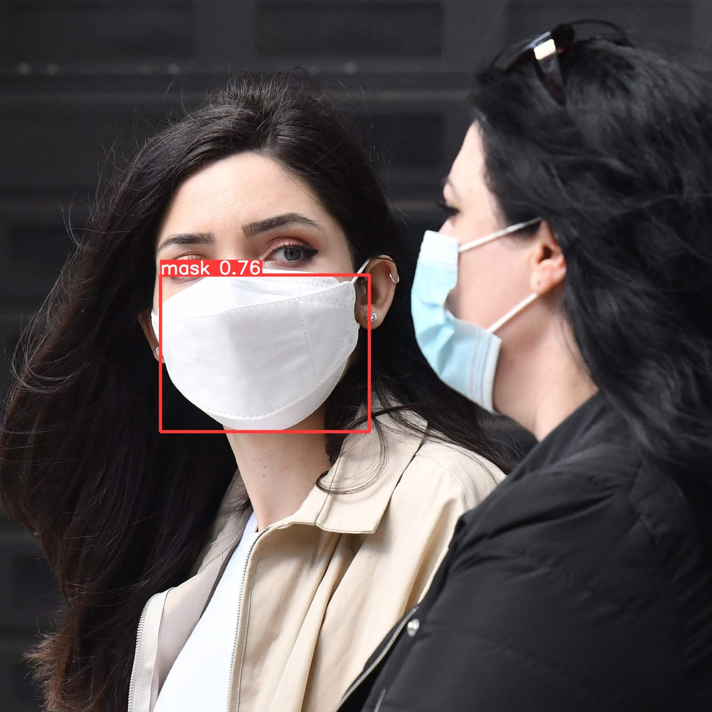

## Results obtained with different experiments
### Experiment 1: same set of images used for training and validation and trained for 50 epochs
###Result : The precision obtained is 96% and recall obtained is 94%

Epoch   gpu_mem       box       obj       cls    labels  img_size
     47/49     3.34G   0.03832   0.01913         0         2       608: 100% 4/4 [00:05<00:00,  1.46s/it]
               Class     Images     Labels          P          R     mAP@.5 mAP@.5:.95: 100% 2/2 [00:01<00:00,  1.08it/s]
                 all         50         51       0.96      0.941      0.976      0.603

     Epoch   gpu_mem       box       obj       cls    labels  img_size
     48/49     3.34G   0.04834   0.02353         0         4       608: 100% 4/4 [00:06<00:00,  1.70s/it]
               Class     Images     Labels          P          R     mAP@.5 mAP@.5:.95: 100% 2/2 [00:01<00:00,  1.16it/s]
                 all         50         51      0.814      0.941      0.906      0.535

     Epoch   gpu_mem       box       obj       cls    labels  img_size
     49/49     3.34G   0.04793   0.02304         0         5       608: 100% 4/4 [00:05<00:00,  1.48s/it]
               Class     Images     Labels          P          R     mAP@.5 mAP@.5:.95: 100% 2/2 [00:01<00:00,  1.16it/s]
                 all         50         51       0.96      0.941      0.978      0.531
           
           
## result obtained on the test image

### Experiment 2: same set of images but trained for 80 epochs
### Result obtained: The precision obtained is 100% and recall obtained is 100%
 Epoch   gpu_mem       box       obj       cls    labels  img_size
     77/79     3.34G   0.02959   0.01439         0         2       608: 100% 4/4 [00:05<00:00,  1.47s/it]
               Class     Images     Labels          P          R     mAP@.5 mAP@.5:.95: 100% 2/2 [00:01<00:00,  1.29it/s]
                 all         50         51      0.877       0.98      0.936      0.582

     Epoch   gpu_mem       box       obj       cls    labels  img_size
     78/79     3.34G   0.03047   0.01523         0         5       608: 100% 4/4 [00:06<00:00,  1.60s/it]
               Class     Images     Labels          P          R     mAP@.5 mAP@.5:.95: 100% 2/2 [00:01<00:00,  1.13it/s]
                 all         50         51      0.889       0.94      0.925      0.496

     Epoch   gpu_mem       box       obj       cls    labels  img_size
     79/79     3.34G   0.03604   0.01735         0         5       608: 100% 4/4 [00:06<00:00,  1.60s/it]
               Class     Images     Labels          P          R     mAP@.5 mAP@.5:.95: 100% 2/2 [00:01<00:00,  1.35it/s]
                 all         50         51          1          1      0.995      0.729
